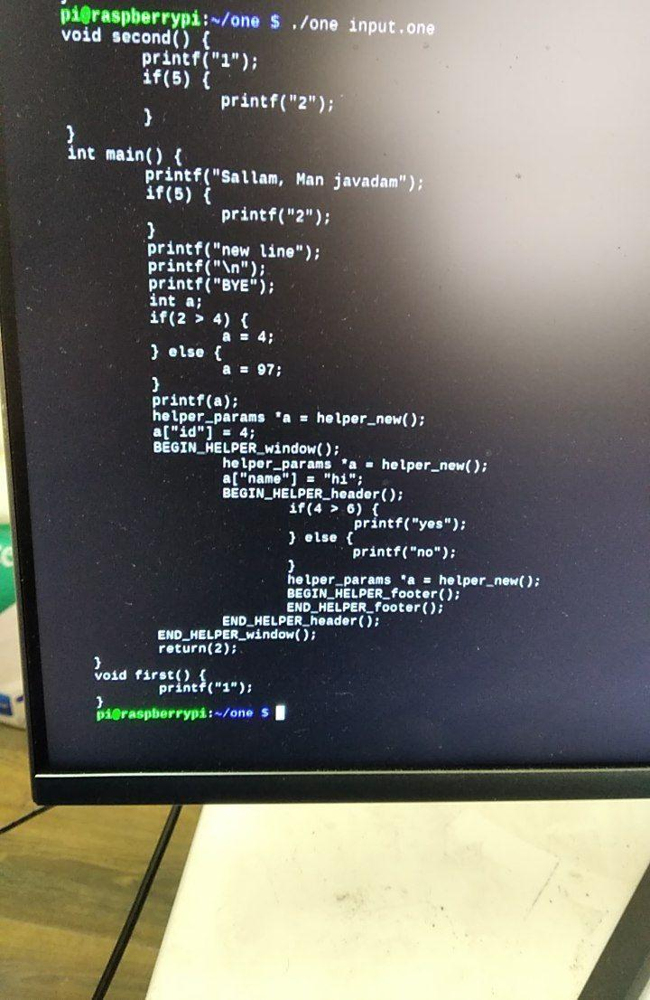
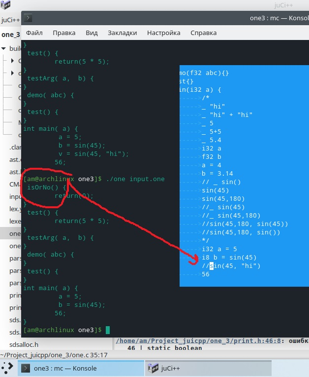
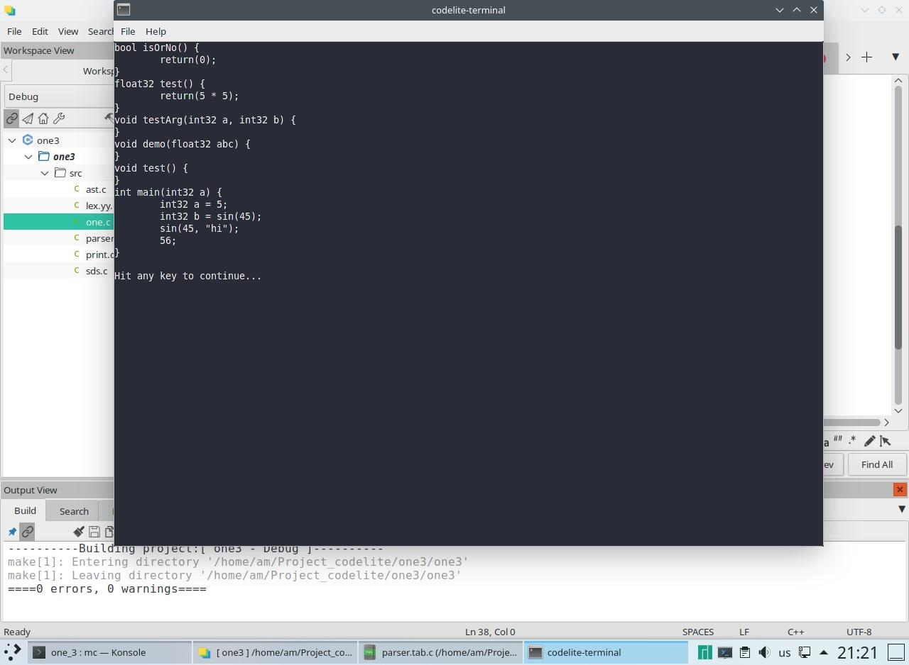

# One-compiler Draft in C

Another attempt to write a compiler in c using flex and bison with all features of Syntax.

## Examples

```
int z = 10
main(){
  str z = 'qq'
  if(true){
    int z= 8
    __z
  }
  __z
}

bool(){
  __z
}
```

## Figures




Oh my god, I waste my time many days for a memory leaks:



After solving the memory leaks:



© Copyright Max Base 2020
